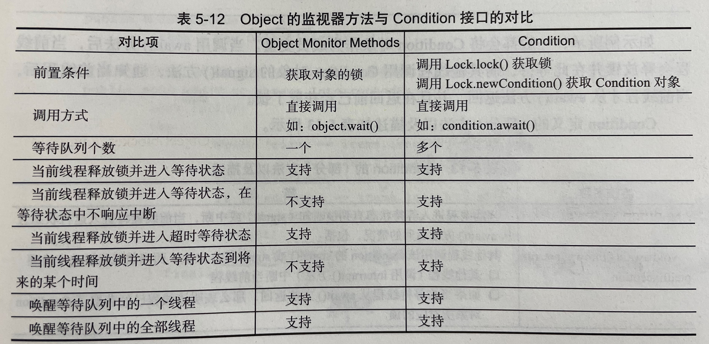

# 等待通知机制与Condition接口

今天讲一下等待/通知机制和Condition接口，其中，后者相当于前者的一种实现方式。

------

## 等待/通知机制

等待/通知机制是Java内置机制，是任意Java对象都具备的，因为相关方法都定义在Object类上，如图所示

)

其中最重要的三个方法为notify()、notifyAll()、wait()方法，我们称之为***监视器方法***。下面看一下书本对该机制的解释：

> 等待/通知机制，是指一个线程A调用了对象O的wait方法进入等待状态，而另一个线程B调用了对象O的notify()或notifyAll()方法，线程A收到通知后从对象O的wait()方法返回，进而执行后续操作。上述线程A与B之间通过对象O进行交互，而对象上的wait()和notify()的关系相当于开关信号一样，用来完成等待方和通知方的交互工作。

以下示例中，WaitThread线程先检查flag值是否为false，如果符合要求，进行后续操作，否则在lock上等待，而NotifyThread在睡眠一段时间后对lock进行通知。

```Java
public class WaitNotify {
        static boolean flag = true;
        static Object lock = new Object();
    
        static class Wait implements Runnable {
            @Override
            public void run() {
                //Add Lock. it has lock's Monitor.
                synchronized (lock) {
                    //when the condition is not satisfied,keep waiting and free lock's Lock;
                    while (flag) {
                        try {
                            System.out.println(Thread.currentThread() + " flag is true.wait @ " +
                                    new SimpleDateFormat("HH:mm:ss").format(new Date()));
                            lock.wait();
                        } catch (InterruptedException e) {
                            e.printStackTrace();
                        }
                    }
                    //while satisfying the condition, complete next work.
                    System.out.println(Thread.currentThread() + " flag is false.running @ " +
                            new SimpleDateFormat("HH:mm:ss").format(new Date()));
                }
            }
        }
    
        static class Notify implements Runnable{
            @Override
            public void run() {
                //Add Lock. it has lock's Monitor.
                synchronized (lock){
                    //获取lock的锁，然后进行通知，通知时不会释放lock的锁，
                    //直到当前线程释放了lock后，WaitThread才能从wait方法中返回
                    System.out.println(Thread.currentThread() + " hold back. notify @ " +
                            new SimpleDateFormat("HH:mm:ss").format(new Date()));
                    lock.notifyAll();
                    flag = false;//如果没有这一步，则会造成死锁
                    SleepUtils.second(5);
                }
                //Add Lock again
                synchronized (lock){
                    System.out.println(Thread.currentThread() + " hold back again. sleep @ " +
                            new SimpleDateFormat("HH:mm:ss").format(new Date()));
                }
            }
        }
    
        public static void main(String[] args) throws Exception{
            Thread waitThread = new Thread(new Wait(), "WaitThread");
            waitThread.start();
            TimeUnit.SECONDS.sleep(1);
            Thread notifyThread = new Thread(new Notify(), "NotifyThread");
            notifyThread.start();
        }
    }
```

其输出如下：

```basic
[WaitThread,5,main] flag is true.wait @ 15:12:25
Thread[NotifyThread,5,main] hold back. notify @ 15:12:26
Thread[NotifyThread,5,main] hold back again. sleep @ 15:12:31
Thread[WaitThread,5,main] flag is false.running @ 15:12:31
```

上述例子主要说明了wait()、notify()、notifyAll()三个方法调用时的注意事项，具体有以下几点：

1. 使用wait()、notify()、notifyAll()三个方法前均需要先对调用该方法的对象进行加锁。
2. 调用wait()方法后，线程状态由RUNNING转换为WAITING，并将当前线程放置在对象的**等待队列**。
3. 调用notify()/notifyAll()后，等待线程依旧不会从wait()方法返回，需要调用notify()/notifyAll()的线程**释放锁**之后，等待线程才**有机会**从wait()方法返回。
4. notify()/notifyAll()方法将等待队列中一个/全部等待线程从等待队列中移到**同步队列**中，被移动的线程状态由WAITING变为BLOCKED。
5. 从wait()方法返回的前提是**获得了调用对象的锁**。

以上五条的目的是确保等待线程从wait()方法返回时能够感知到通知线程对变量做出的修改。

下面说一下以上代码的执行逻辑：

> WaitThread线程首先获取了lock的锁，然后调用其wait()方法，同时释放了lock的锁并进入了对象的等待队列中，进入WAITING状态。由于WaitThread释放了锁，因此NotifyThread随后获取了对象的锁，并调用其notify()方法，将WaitThread线程从**等待队列移入同步队列**，此时WaitThread的状态变为BLOCKED状态。在该线程之后释放lock锁后，WaitThread将有机会再次获取lock锁，并从wait()方法返回继续执行剩余操作。

## 等待/通知的经典范式

等待方相当于消费者，通知方相当于生产者，等待方遵循以下原则：

1. 获取对象的锁。
2. 如果条件不满足，调用对象的wait()方法，被通知后仍要检查条件。
3. 条件满足后执行随后的逻辑。

通知方遵循以下原则：

1. 获取对象的锁。
2. 改变条件。
3. 通知等待在对象上的线程。

## Condition接口

前面说过，由于等待/通知相关方法都定义在Object类上，因此任意一个Java对象都拥有一组监视器方法，这些方法与synchronized同步关键字配合实现等待/通知模式。而另一实现等待/通知模式的方法是**Condition接口提供的类似Object的监视器方法与Lock配合**。

 下图给出了Object的监视器方法与Condition接口的对比：



特别注意的区别是前置条件中，condition对象是调用Lock对象的newCondition()方法创建出来的，此外，Condition接口的等待队列有多个，而Object监视器只有一个，而且，Condition接口实现的情景相对较多。

### Condition接口与示例

Condition的使用方式需要注意在调用方法前获取锁（与之前的Object监视器方法一致），示例代码如下：

```java
public class ConditionUseCase {
    //重入锁
    Lock lock = new ReentrantLock();
    //一般会将condition对象作为成员变量
    Condition condition = lock.newCondition();
    
    public void conditionWait() throws InterruptedException{
        lock.lock();
        try {
            condition.await();
        }finally {
            lock.unlock();
        }
    }
    
    public void conditionSignal() throws InterruptedException{
        lock.lock();
        try {
            condition.signal();
        }finally {
            lock.unlock();
        }
    }
}
```

以下是Condition接口的结构：


对应于Object监视器方法，await()对应于wait()，signal()对应于notify()，signalAll()对应于notifyAll()。下面通过一个有界队列的示例深入了解Condition的使用方式。

**有界队列**：当队列为空时，队列的获取操作将会阻塞获取线程，直到队列中有新增元素，当队列已满时，队列的插入操作会阻塞插入线程，直到队列中有空位置。

```java
public class BoundedQueue<T> {
    private Object[] items;
    //添加的下标，删除的下标和数组当前非空的对象数量
    private int addIndex, removeIndex, count;
    private Lock lock = new ReentrantLock();
    private Condition notEmpty = lock.newCondition();
    private Condition notFull = lock.newCondition();

    public BoundedQueue(int size) {
        items = new Object[size];
    }
    
    public void add(T t) throws InterruptedException{
        //获得锁，确保数组修改的可见性和排他性
        lock.lock();
        try {
            //如果数组满，则添加线程进入等待状态，直到有“空位”
            while (count == items.length){
                notFull.await();
            }
            items[addIndex] = t;
            if (++addIndex == items.length)
                addIndex = 0;
            ++count;
            //通知等待在notEmpty的线程，数组中已经有新元素可以获取
            notEmpty.signal();
        }finally {
            lock.unlock();
        }
    }
    
    public T remove() throws InterruptedException{
        //获得锁，确保数组修改的可见性和排他性
        lock.lock();
        try {
            //如果数组为空，则删除线程进入等待状态，直到有新添加元素
            while (count == 0){
                notEmpty.await();
            }
            Object x = items[removeIndex];
            if (++removeIndex == items.length)
                removeIndex = 0;
            --count;
            //通知等待在notFull的线程，数组中已经有新“空位”可以添加元素
            notFull.signal();
            return (T) x;
        }finally {
            lock.unlock();
        }
    }
}
```

### Condition的实现分析

#### 等待队列

一个Condition包含一个等待队列，相比之下，在Object的监视器模型上，一个对象拥有一个同步队列和一个等待队列。而并发包中的Lock（更确切的说是同步器）拥有一个同步队列和**多个等待队列**，其对应关系如下图所示。


如图所示，每个Condition的头指针指向同步器，每一个等待队列都对应着一个Condition。

#### 等待

从队列的角度看await()方法，当调用await()方法时，相当于同步队列的首节点（获取了锁的节点）移动到了Condition的等待队列中。注意，这里同步队列的首节点并非直接加入等待队列，而是通过addConditionWaiter()方法**把当前线程构造成一个新的节点并将其加入等待队列中**。

#### 通知

调用Condition的signal()方法，将会唤醒在等待队列中等待时间最长的节点（首节点），在唤醒节点之前，会将节点移动到同步队列中。